# Tasks

## Task 1

### Description

- Setup SGW using setup 1
- Use Postman to check if SGW is working (use Admin PORT)

### Observations

Procedure I did for TASK 1:

-Created main couchbase cluster
-Create a new bucket
-Create a new user for syncgateway and assign permissions in security port
-Take the config.json and put it in a directory (for eg in documents)
-Pull the couchbase syncgateway image
-Start the couchbase syncgatewa container
-Use curl to make a PUT request to configure the syncgateway. (Run the curl command inside the syncgateway container)
```
curl --location --request PUT 'http://127.0.0.1:4985/db/' --header 'Content-Type: application/json' --data-raw '{"bucket": "syncgateway","num_index_replicas": 0, "enable_shared_bucket_access": true,
 "import_docs": true}' -u rahulvk007
 ```
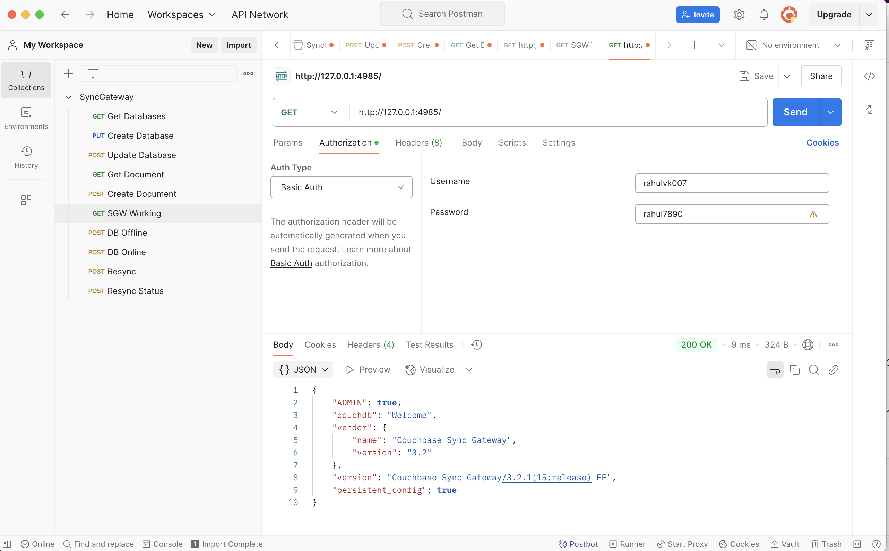

SOLUTION FOR TASK 1: EDIT config1.json and add this

```
"api": {
    "admin_interface": "0.0.0.0:4985"
  }
  ```

## Task 2

### Description

- Setup SGW using setup 2
- Create a Database using Postman
- Create a Document using Postman
- Get the document using Postman

### Observations

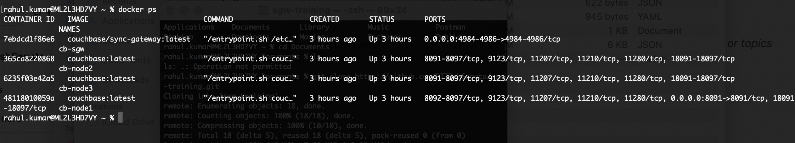


CREATE DATABASE

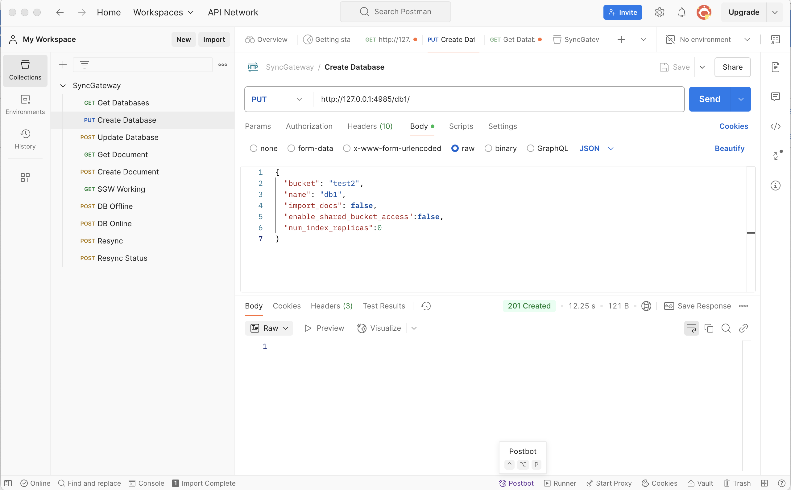

UPDATE TO ENABLE SHARED BUCKET ACCESS AND IMOORT DOCS

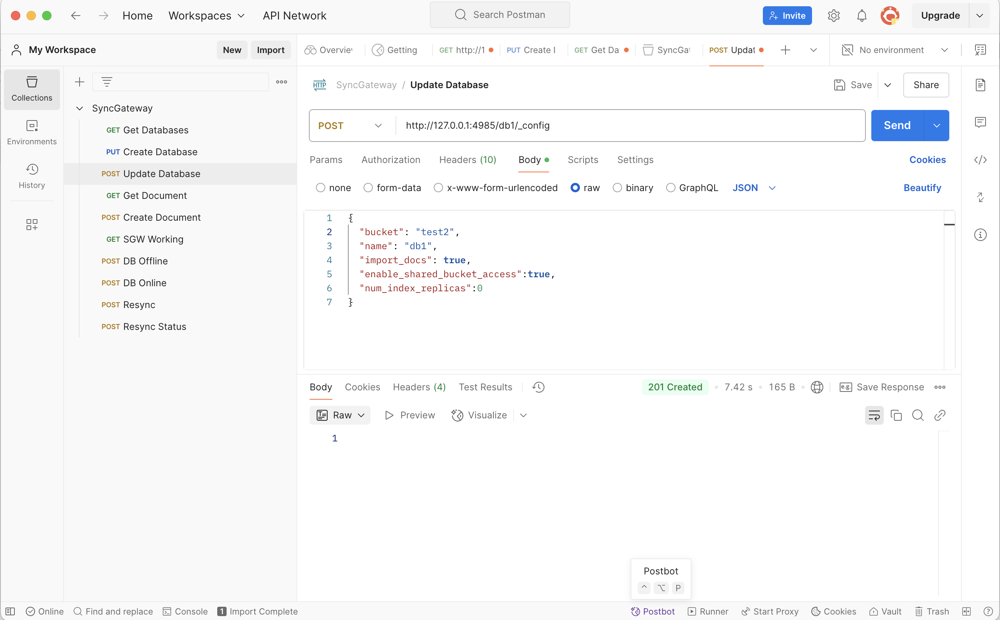

CREATE DOCUMENT

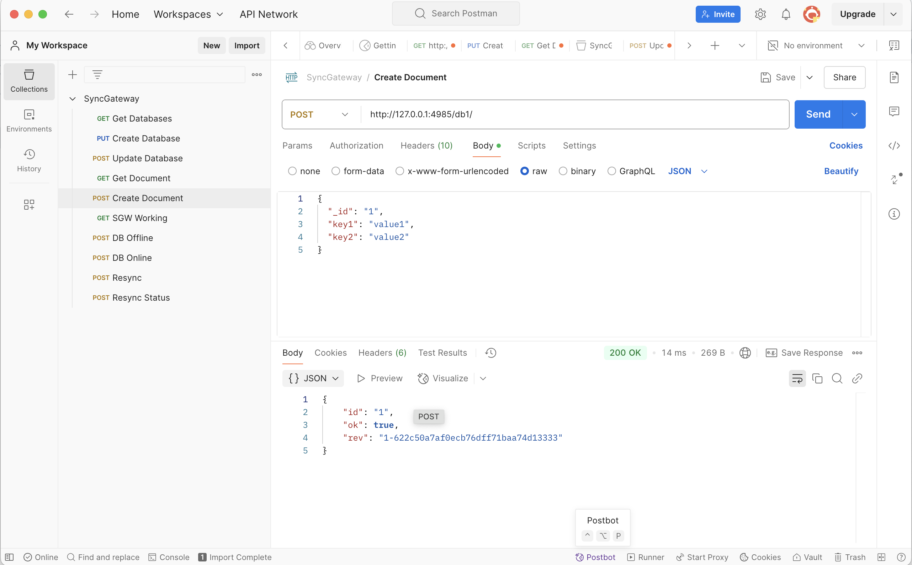

GET DOCUMENT

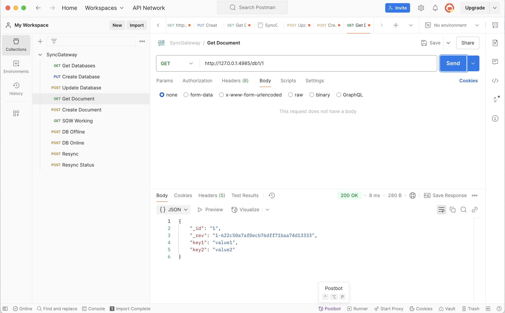


## Task 3

### Description

- This task continues from the previous task
- Create a dummy document from CB UI
- Get the document contents using Postman
- Delete the document using Postman

### Observations

Created a dummy document in my bucket with id 2 through UI
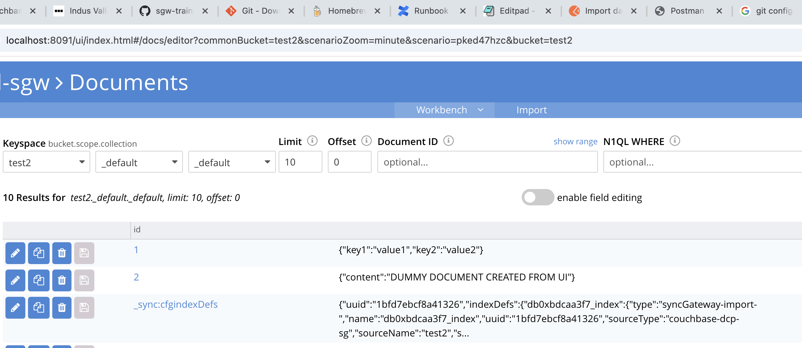

In postman send a get request to ```http://127.0.0.1:4985/db1/2```

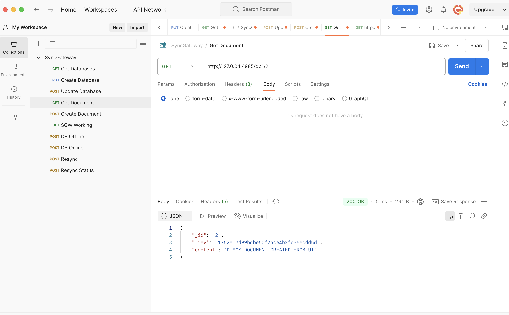


## Task 4

### Description

- Create a document from Couchbase Server UI
- Review the revision IDs and explain the different values in revision IDs

### Observations

Revision ID describes the current version of the document. For example:
```
{
  "meta": {
    "id": "2",
    "rev": "2-181b6f5882c700000000000002000006",
    "expiration": 0,
    "flags": 33554438,
    "type": "json"
  },
  "xattrs": {
    "_mou": {
      "cas": "0x0000c782586f1b18",
      "pCas": "0x0000a282586f1b18"
    },
    "_sync": {
      "cas": "0x0000c782586f1b18",
      "channel_set": null,
      "channel_set_history": null,
      "cluster_uuid": "9155dbbdd9cfcf374b972e4dffe1b65e",
      "history": {
        "channels": [
          null
        ],
        "parents": [
          -1
        ],
        "revs": [
          "1-52e07d99bdbe50f26ce4b2fc35ecdd5d"
        ]
      },
      "recent_sequences": [
        2
      ],
      "rev": "1-52e07d99bdbe50f26ce4b2fc35ecdd5d",
      "sequence": 2,
      "time_saved": "2025-01-17T09:01:47.222560546Z",
      "value_crc32c": "0x34043e82"
    }
  }
}
```
This was the original Metadata. Note the "rev" field.
Now i made a modification to the document
Now this is the metadata:
```
{
  "meta": {
    "id": "2",
    "rev": "4-181b6ff330be00000000000002000006",
    "expiration": 0,
    "flags": 33554438,
    "type": "json"
  },
  "xattrs": {
    "_mou": {
      "cas": "0x0000be30f36f1b18",
      "pCas": "0x00009230f36f1b18"
    },
    "_sync": {
      "cas": "0x0000be30f36f1b18",
      "channel_set": null,
      "channel_set_history": null,
      "cluster_uuid": "9155dbbdd9cfcf374b972e4dffe1b65e",
      "history": {
        "channels": [
          null,
          null
        ],
        "parents": [
          -1,
          0
        ],
        "revs": [
          "1-52e07d99bdbe50f26ce4b2fc35ecdd5d",
          "2-2144b63db2e616c2fb5d95dc0aec90f6"
        ]
      },
      "recent_sequences": [
        2,
        3
      ],
      "rev": "2-2144b63db2e616c2fb5d95dc0aec90f6",
      "sequence": 3,
      "time_saved": "2025-01-17T09:12:51.56654384Z",
      "value_crc32c": "0x25a63f8f"
    }
  }
}
```
You can see that in the list now we have two "revs" values. If i edit one more time, there will be three. So revision IDs basically store the id of the each version of the document from its time of creation.

## Task 5

### Description

- Test the following configurations of SGW database:

```
1. enable_shared_bucket_access: false, import_docs: false
2. enable_shared_bucket_access: false, import_docs: true
3. enable_shared_bucket_access: true, import_docs: false
4. enable_shared_bucket_access: true, import_docs: true
```

### Observations

1. SHARED BUCKET ACCESS AND IMPORT DOCS FALSE
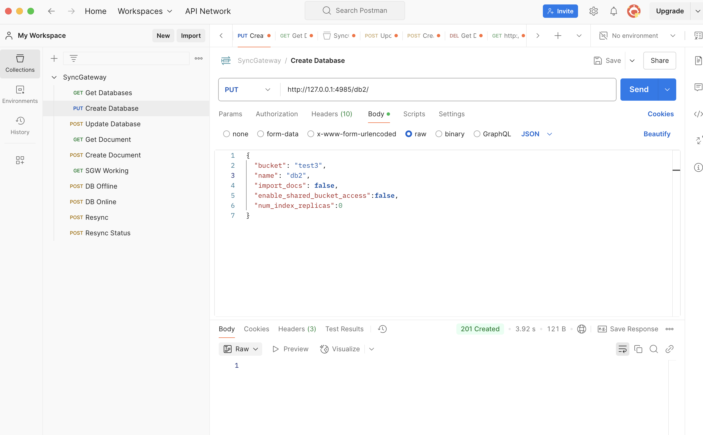

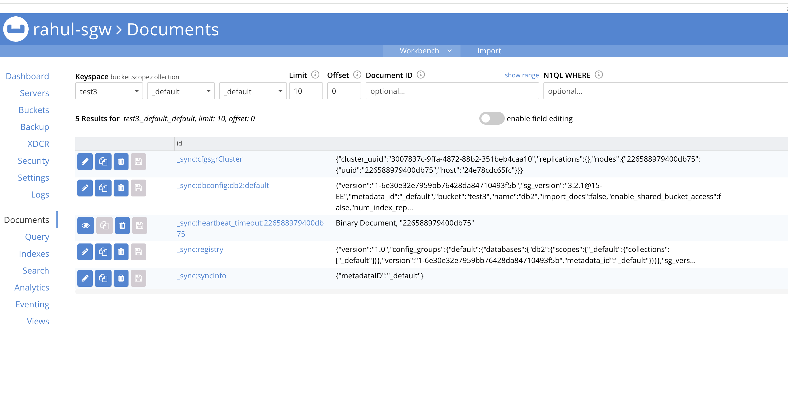

5 docs are created by default

I created a document in UI but i cannot get it through sync gateway since it is not imported as import docs is false
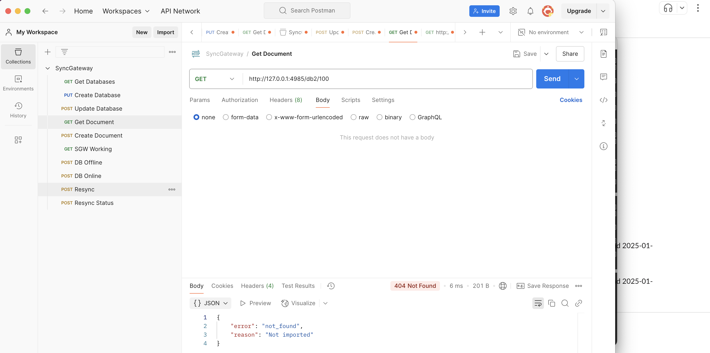

2. SHARED BUCKET : FALSE AND IMPORT DOCS TRUE IS NOT POSSIBLE


You cannot enable import docs without enabling shared bucket access since without permission to access buckets in the cb server you cannot import docs.

3. ENABLED SHARED BUCKET ACCESS BUT DISABLED IMPORT DOCS

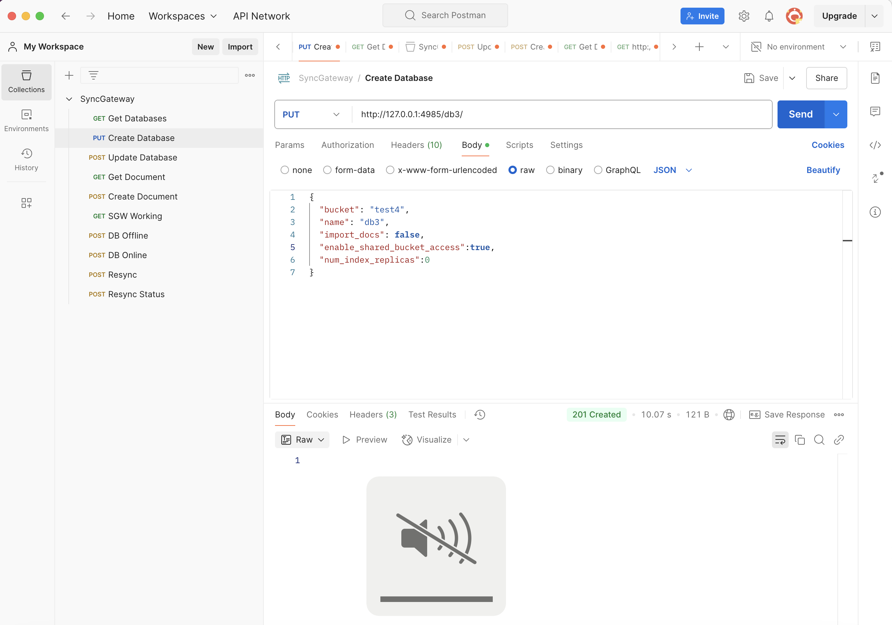

WE ARE ABLE TO ACCESS DOCUMENT CREATED USING UI SINCE SHARED BUCKET ACCESS IS TRUE
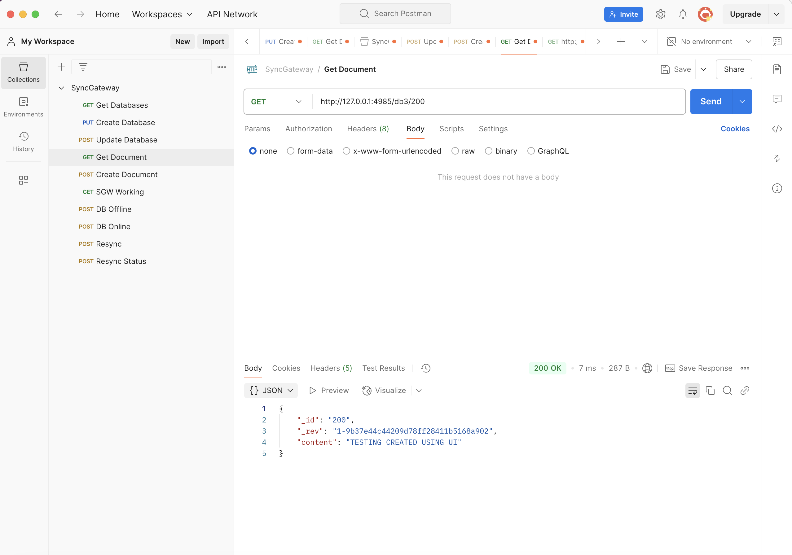
BUT ACCESS TOOK 7MS as it had to fetch from cb server

4. BOTH ENABLED
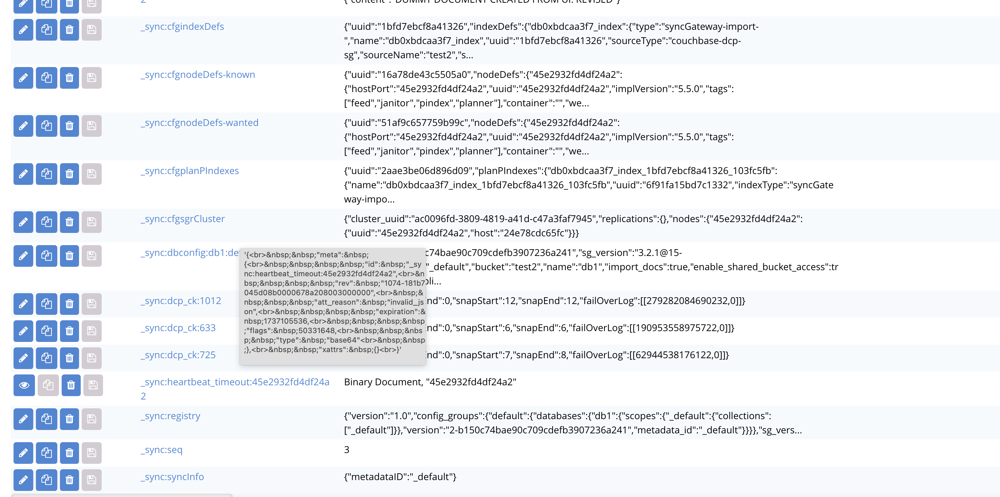


YOU CAN ACCESS THE DOCS FROM SYNCGATEWAY .

IT ONLY TOOK 4 MS SINCE IT IS ALREADY IMPORTED INTO SYNCGATEWAT
