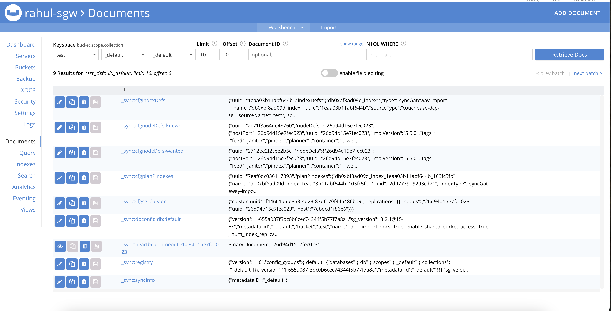

# Tasks

## Task 1

### Description

- Setup SGW using setup 1
- Use Postman to check if SGW is working (use Admin PORT)

### Observations
The admin API works through postman

 ```
"api": {
    "admin_interface": "0.0.0.0:4985"
  },
  ```
  is important in the task

  


## Task 2

### Description

- Setup SGW using setup 2
- Create a Database using Postman
- 

- Create a Document using Postman
  
  
- Get the document using Postman
  


### Observations
Used postman to complete the tasks. The bucket should already exist before these tasks.

## Task 3

### Description

- This task continues from the previous task
- Create a dummy document from CB UI
- Get the document contents using Postman
- Delete the document using Postman

### Observations

## Task 4

### Description

- Create a document from Couchbase Server UI
- Review the revision IDs and explain the different values in revision IDs

### Observations

## Task 5

### Description

- Test the following configurations of SGW database:

```
1. enable_shared_bucket_access: false, import_docs: false
2. enable_shared_bucket_access: false, import_docs: true
3. enable_shared_bucket_access: true, import_docs: false
4. enable_shared_bucket_access: true, import_docs: true
```

### Observations
